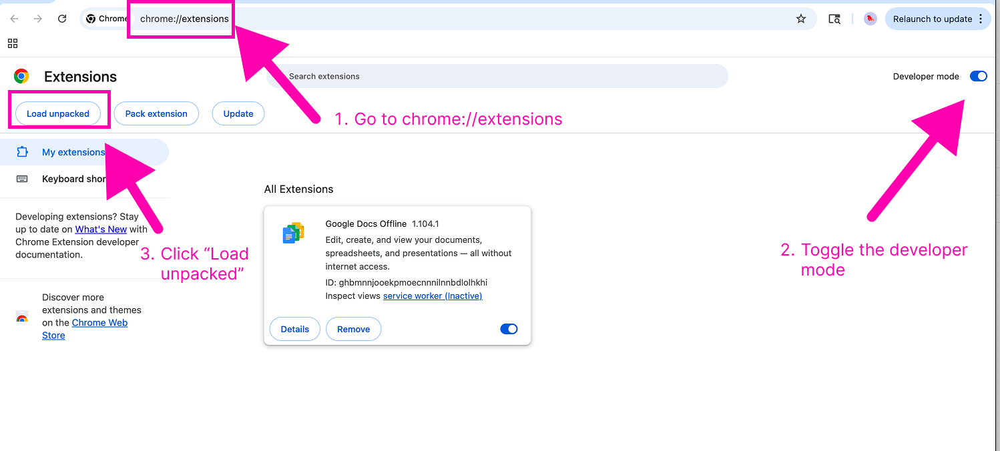
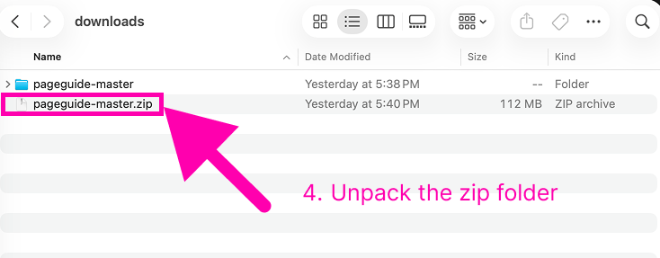
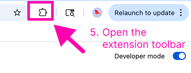
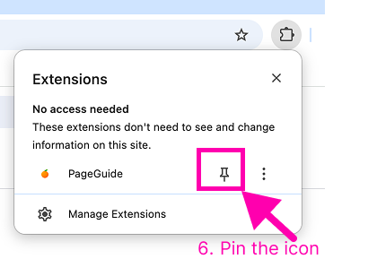
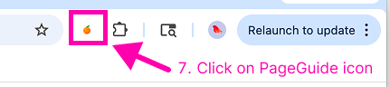

1. **Download**

- Download the [latest zip](https://github.com/tin-xai/pageguide/releases/download/pageguide/pageguide-master.zip) file this repo (`master` branch: https://github.com/tin-xai/pageguide).

2. **Install**

- 1. Open Chrome and go to `chrome://extensions/`
- 2. Enable **Developer mode** (toggle in top right)
- 3. Click **Load unpacked**
  

    
  

- 4. Select the `pageguide` folder from the downloaded and unpacked zip file
  

    
  

- 5.Click Extension icon
  

    
  

- 6.Pin the extension icon to your toolbar
  

    
  

- 7. Use the extension by clicking the icon in the toolbar
  

    
  

3. **Upgrading**

- Download the [latest zip](https://github.com/tin-xai/pageguide/archive/refs/heads/master.zip) file
- Unzip and replace the existing `pageguide` folder.
- Reload the extension in `chrome://extensions/` by clicking the reload button on the extension card.
